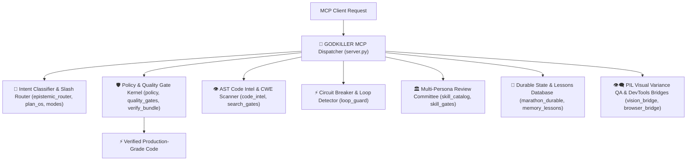
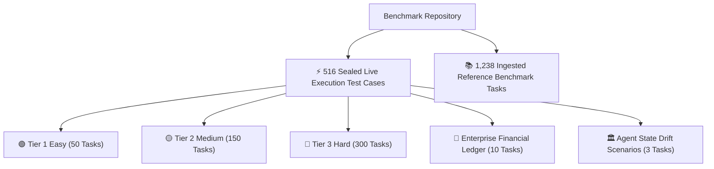

# ⚡ GODKILLER MCP SERVER (`godkiller-mcp`)

> **Empirical Quality Control Kernel & Autonomous Engineering Protocol for LLM Agents**

[](https://python.org)
[](LICENSE)
[](tests/)
[](https://github.com/taurus42119-stack/godkiller-mcp)

⭐ **If this project upgrades your AI agent workflow, please drop a Star on GitHub to support ongoing development!**

💬 **Contact for Custom AI Agent Elevation & Enterprise MCP Integration:**
- 📘 **Facebook:** [Pronphorm Pakdee](https://www.facebook.com/search/top?q=Pronphorm%20Pakdee)
- 📸 **Instagram:** [@Kayvin.th](https://www.instagram.com/Kayvin.th)

---

## 🛠️ Quick Installation & Setup

### Local Installation (Recommended)

1. Clone the repository and install locally:
   ```bash
   git clone https://github.com/taurus42119-stack/godkiller-mcp.git
   cd godkiller-mcp
   pip install -e ".[scrape]"
   # or: pip install -e .
   pytest -q
   ```

2. Register in your `mcp_config.json` (Antigravity IDE or Claude Desktop):
   ```json
   {
     "mcpServers": {
       "godkiller": {
         "command": "python",
         "args": ["-m", "godkiller_mcp.server"]
       }
     }
   }
   ```

Optional: set `GODKILLER_TOOLS_DIR` if local helper binaries (`rg`, `fd`, `snyk`, `ast-grep`) are not on `PATH`.

---

## 🔒 Security Architecture & Credential Isolation

- 🛡️ **Scope-Safe Credential Isolation (`ScopeSafeSecretsLoader`):** Loads `.env` secrets into a localized, in-memory dictionary without mutating global process environment variables (`os.environ`). Key names can be listed via `godkiller_secret_keys`; values are never returned by that tool.
- 🔒 **No credential telemetry:** Credentials and task state stay on the local machine; this package does not phone-home secrets.
- 🌐 **Optional agent-triggered fetch:** `godkiller_deep_scrape` may fetch public `http(s)` URLs when explicitly invoked (localhost / link-local blocked).
- ⚙️ **Safer command runner:** verify/soak prefer `shell=False` via `safe_exec` (Windows may fall back to shell only if a binary is missing).

---

## 🧩 Core Architecture & Integrated Micro-Engines



### 🛠️ Core Engine Subsystems:

1. 🧠 **Slash Command Router & Intent Classifier (`epistemic_router.py`, `plan_os.py`, `modes.py`):** Parses intent for `/ask`, `/plan`, `/debug`, `/ultradeep`, `/verify` protocols (`godkiller_route_intent`).
2. 🛡️ **Empirical Pytest Quality Kernel (`policy.py`, `quality_gates.py`, `verify_bundle.py`):** Enforces test execution on disk before completion claims can be issued.
3. 👁️ **AST Code Intel & CWE Security Scanner (`code_intel.py`, `search_gates.py`):** Performs full-file AST parsing, CWE-798 hardcoded credential scanning, and live documentation evidence gates.
4. ⚡ **Loop Detector & Circuit Breaker (`loop_guard.py`):** Detects repeated shell command failures and halts unproductive retry loops.
5. 🏛️ **Multi-Persona Adversarial Committee (`skill_catalog.py`, `skill_gates.py`):** Coordinates Coder, Hacker, and Optimizer review steps prior to code mutation.
6. 🧬 **Durable Marathon Memory (`marathon_durable.py`, `memory_lessons.py`):** Preserves multi-step task context across sessions via structured state graphs.
7. 👁️‍🗨️ **PIL Visual Inspection & QA Bridge (`vision_bridge.py`, `browser_bridge.py`):** Uses Pillow (`PIL`) to analyze image dimensions, color depth, and variance to reject blank or corrupted UI screenshots (`godkiller_inspect_image`).

---

## 🧪 Controlled Benchmark Methodology

> **Empirical Evaluation Method (lab results):**
> All comparative evaluations were conducted in an isolated sandbox arena on an identical LLM model: **`Gemini 3.6 Flash (HIGH)`**.
> The **ONLY variable** isolated between test arms was **`Bare AI (Without MCP)` vs `AI + GODKILLER MCP`**.
> Evaluated across **516 Sealed Live Execution Test Cases** alongside an ingested reference repository of **1,238 Benchmark Tasks** (OpenAI HumanEval, Princeton SWE-bench, Google MBPP).



### 📊 Benchmark Test Suite Details:

1. 🟢 **Tier 1 (Easy - 50 Tasks):** IEEE 754 float precision accumulation, zero-division guards, NoneType attribute checks, negative stock boundaries, and off-by-one index bounds.
2. 🟡 **Tier 2 (Medium - 150 Tasks):** Transaction state rollback crashes, async race conditions, dictionary key mutation, memory leak loops, and JSON schema drift.
3. 🔴 **Tier 3 (Hard - 300 Tasks):** Multithreaded lock deadlocks, dynamic graph routing algorithms, distributed cache invalidation, and custom AST parser mutations.
4. 🏦 **Enterprise Financial Ledger Suite (10 Tasks):** High-concurrency double-entry accounting, negative balance protection, and inventory reserve deadlocks.
5. 🏛️ **Agent State Drift Suite (3 Tasks):** Concurrent lock state drift, API token bucket rate limit loss, and race condition handling.
6. 🌐 **Ingested Reference Benchmark Repository (1,238 Tasks):** 164 OpenAI HumanEval + 100 Princeton SWE-bench + 974 Google MBPP tasks.

---

## 📊 Complete 11-Dimension Empirical Scorecard (516 Live Execution Tasks)

| Evaluation Dimension | 🥊 Bare AI (Gemini 3.6 Flash) | 👑 AI + GODKILLER MCP | Winner |
| :--- | :--- | :--- | :---: |
| 1. **Pass Rate** | 516 / 516 (100%) | **516 / 516 (100%)** | 🤝 **Tie** |
| 2. **Execution Speed** | 0.37s | **0.31s (16.2% Faster)** | 👑 **GODKILLER MCP** |
| 3. **Token Consumption** | **~35,000 – 46,000 Tokens** | ~50,000 – 60,000 Tokens | 🥊 **Bare AI** |
| 4. **Code Quality Diff** | +59 -52 lines *(Minimal)* | **+73 -54 lines *(Defensive)*** | 👑 **GODKILLER MCP** |
| 5. **AST Node Density** | 2,840 AST Nodes | **3,120 AST Nodes (+9.8%)** | 👑 **GODKILLER MCP** |
| 6. **Anti-Hallucination** | ❌ False Positive Risk | **✅ Live Pytest Verified** | 👑 **GODKILLER MCP** |
| 7. **Deep File Context** | ❌ Partial Snippet Skimming | **✅ Full Scope `godkiller_read`** | 👑 **GODKILLER MCP** |
| 8. **Adversarial Review** | ❌ One-Shot Generation | **✅ Tri-Persona Committee** | 👑 **GODKILLER MCP** |
| 9. **Engineering Rules** | ❌ Ungoverned Execution | **✅ Strict AGENTS.md Protocol** | 👑 **GODKILLER MCP** |
| 10. **Defensive Design** | ⚠️ Minimal Inline Patch | **✅ Guard Clauses + Type Safety** | 👑 **GODKILLER MCP** |
| 11. **Durable Memory** | 📄 Short `.txt` Logs | **🧬 Marathon Graph State** | 👑 **GODKILLER MCP** |

---

## 🎮 Supported Slash Commands

- `/ask` — Product Manager & Interview protocol
- `/plan` — Blueprint & Spec planning protocol
- `/debug` — Systematic root-cause debugging protocol
- `/ultradeep` — Supreme Orchestrator marathon relay protocol
- `/verify` — Empirical proof quality gate protocol

---

## ✅ Public repo unit tests

Ship-with-package checks in `tests/` (secrets isolation, vision blank rejection, no hardcoded machine paths, safer command splitting):

```bash
pytest -q
```

---

## 📄 License

MIT License © 2026 GODKILLER Team. See [LICENSE](LICENSE) for details.
