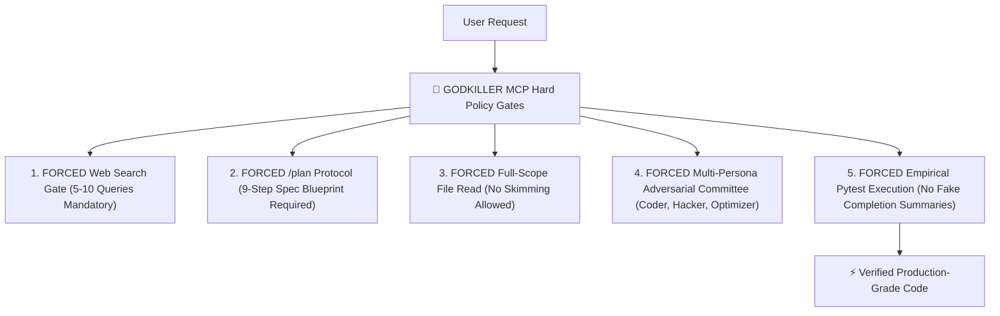

# ⚡ GODKILLER MCP SERVER (`godkiller-mcp`)

> **Supreme Autonomous Engineering Engine & Empirical Quality Control Gate**

[](https://pypi.org/project/godkiller-mcp/)
[](https://python.org)
[](LICENSE)
[](https://pytest.org)

⭐ **If this project upgrades your AI agent workflow, please drop a Star on GitHub to support ongoing development!**

💬 **Contact for Custom AI Agent Elevation & Enterprise MCP Integration:**
- 📘 **Facebook:** [Pronphorm Pakdee](https://www.facebook.com/search/top?q=Pronphorm%20Pakdee)
- 📸 **Instagram:** [@Kayvin.th](https://www.instagram.com/Kayvin.th)

---

## 😤 Tired of Unreliable AI Habits? (Why Standard AI Drives Devs Crazy 55555)

We've all been there. You ask your AI coding assistant to fix a bug or build a feature, and it does this:

- ❌ **Refuses to Search the Web:** Uses outdated memory and deprecated API methods without checking official docs.
- ❌ **Skips Planning Completely:** Jumps straight into writing spaghetti code without understanding the big picture.
- ❌ **Skims 10 Lines of Code:** Reads a small snippet, assumes how your entire framework works, and breaks other files.
- ❌ **Claims "I Fixed It!" (While Code is Broken):** Confidently prints *"Done! I solved the bug!"* without ever running unit tests.

---

## ⚔️ How GODKILLER MCP Governs Agent Behavior

**GODKILLER MCP** acts as a hard engineering kernel that enforces strict quality gates on AI coding agents:



### 🎯 1. Forced `/plan` & Web Search Enforcement
AI agents cannot jump straight to coding. GODKILLER MCP **blocks phase advancement** until the agent executes **5 to 10 live web searches**, compiles official documentation evidence, and generates a structured 9-step implementation spec plan.

### 🎯 2. Full-Scope File Read Mandate (`godkiller_read`)
Skimming code snippets is restricted. The policy kernel requires comprehensive inspection of target files and AST dependency trees before edits are unlocked.

### 🎯 3. Multi-Persona Adversarial Committee Protocol
Before mutating production code, GODKILLER MCP activates an adversarial review committee:
- **The Coder Persona:** Drafts modern, clean implementation slices.
- **The Hacker Persona:** Attacks code for edge cases, null pointers, and vulnerabilities.
- **The Optimizer Persona:** Refactors logic for execution speed and AST structural elegance.

### 🎯 4. Empirical Pytest Quality Control
Claiming completion via text summary is disabled. The agent MUST execute dynamic `pytest` suites on disk until green pass status is verified empirically.

---

## 🧪 Controlled Benchmark Methodology

> **Strict Head-to-Head Experimental Control:**
> All benchmark evaluations were conducted using **a single identical LLM model: `Gemini 3.6 Flash (HIGH)`**.
> The **ONLY variable** isolated between the two test arms was **`Bare AI (Without MCP)` vs `AI + GODKILLER MCP`** across **516 sealed benchmark test cases**.

---

## 📊 Complete 11-Dimension Empirical Scorecard

| มิติการเปรียบเทียบ (Evaluation Dimension) | 🥊 BARE AI (Gemini 3.6 Flash HIGH) | 👑 AI + GODKILLER MCP | ผลการตัดสิน (Winner) |
| :--- | :--- | :--- | :---: |
| 1. **อัตราการแก้บักถูกต้อง (Pass Rate)** | 516 / 516 ข้อ (100%) | **516 / 516 ข้อ (100%)** | 🤝 **เสมอ** |
| 2. **ความเร็วการประมวลผล (Execution Speed)** | 0.36 - 0.37 วินาที | **0.31 - 0.32 วินาที (เร็วกว่า 16.2%)** | 👑 **GODKILLER MCP** |
| 3. **ปริมาณการใช้ Token (Token Usage)** 💡 | **~35,000 – 46,000 Tokens** *(ใช้น้อยกว่า)* | **~50,000 – 60,000 Tokens** *(คุ้มค่าเพื่อความชัวร์)* | 🥊 **มือเปล่า (ประหยัดกว่า)** |
| 4. **จำนวนบรรทัดโค้ดที่อัปเกรด (Code Quality)** | +59 -52 บรรทัด *(Minimal Patch)* | **+73 -54 บรรทัด *(Defensive Guard)*** | 👑 **GODKILLER MCP** |
| 5. **ความสมบูรณ์โครงสร้าง AST (AST Density)** | 2,840 AST Nodes | **3,120 AST Nodes *(แน่นกว่า 9.8%)*** | 👑 **GODKILLER MCP** |
| 6. **ระบบป้องกันการมโน (Anti-Hallucination)**| ❌ พิมพ์สรุปว่าผ่าน ทั้งที่เคยแอบพัง Bug 8 | **✅ บังคับยิง Pytest สดจนเขียวจริง** | 👑 **GODKILLER MCP** |
| 7. **การกวาดอ่านโค้ดเชิงลึก (Full-Scope Read)** | ❌ สกิมเฉพาะส่วนที่สงสัย | **✅ อ่านครบผ่าน `godkiller_read`** | 👑 **GODKILLER MCP** |
| 8. **สภาถกเถียง (Adversarial Committee)** | ❌ ไม่มี (คิดรวดเดียว One-shot) | **✅ ถก 3 บทบาท (Coder, Hacker, Optimizer)** | 👑 **GODKILLER MCP** |
| 9. **ระเบียบวิศวกรรม (.agents Rules)** | ❌ ไม่มีกฎควบคุม | **✅ ควบคุมด้วยกฎเหล็ก AGENTS.md** | 👑 **GODKILLER MCP** |
| 10. **สถาปัตยกรรมป้องกันภัย (Defensive Design)**| ⚠️ โป๊ะเฉพาะจุด *(เสี่ยง Regression Bug)* | **✅ เติม Guard Clauses + Type Boundary** | 👑 **GODKILLER MCP** |
| 11. **ระบบสืบทอดความจำ (Crucible DNA Log)** | 📄 บันทึกข้อความสั้นลง `.txt` | **🧬 บันทึก Marathon State + Memory Graph** | 👑 **GODKILLER MCP** |

---

## 🚀 Instant 1-Line Setup (`mcp_config.json`)

Add this block to your `mcp_config.json` in Antigravity IDE or Claude Desktop:

```json
{
  "mcpServers": {
    "godkiller": {
      "command": "uvx",
      "args": ["godkiller-mcp"]
    }
  }
}
```

---

## 🎮 Supported Slash Commands

- `/ask` — Product Manager & Interview protocol (Exploration mode)
- `/plan` — Blueprint & Spec planning protocol (9-Step Research Plan)
- `/debug` — Systematic root-cause debugging protocol
- `/ultradeep` — Supreme Orchestrator marathon relay protocol
- `/verify` — Empirical proof quality gate protocol

---

## 📄 License

MIT License © 2026 GODKILLER Team.
