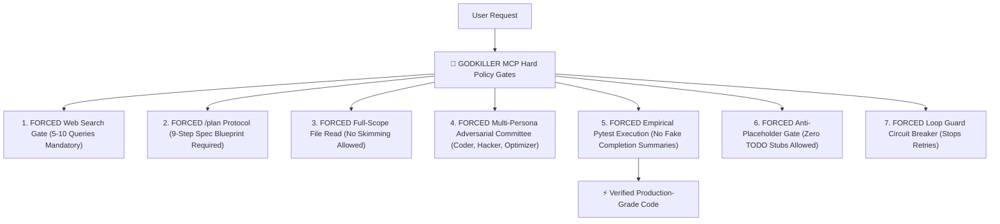

# ⚡ GODKILLER MCP SERVER (`godkiller-mcp`)

> **Autonomous Quality Control Engine & Empirical Engineering Protocol**

[](https://python.org)
[](LICENSE)
[](https://github.com/taurus42119-stack/godkiller-mcp)

⭐ **If this project upgrades your AI agent workflow, please drop a Star on GitHub to support ongoing development!**

💬 **Contact for Custom AI Agent Elevation & Enterprise MCP Integration:**
- 📘 **Facebook:** [Pronphorm Pakdee](https://www.facebook.com/search/top?q=Pronphorm%20Pakdee)
- 📸 **Instagram:** [@Kayvin.th](https://www.instagram.com/Kayvin.th)

---

## 🛠️ Installation & Setup Guide

### Option 1: Direct Local Setup (Recommended)

1. Clone this repository to your local machine:
   ```bash
   git clone https://github.com/taurus42119-stack/godkiller-mcp.git
   cd godkiller-mcp
   pip install -e .
   ```

2. Add this block to your `mcp_config.json` in Antigravity IDE or Claude Desktop:
   ```json
   {
     "mcpServers": {
       "godkiller": {
         "command": "python",
         "args": ["-m", "godkiller_mcp.server"]
       }
     }
   }
   ```

---

## ⚠️ Autonomous Agent Failure Modes & Solution Mechanics

Standard LLM coding assistants frequently encounter critical failure modes during complex software engineering tasks:

- ❌ **Deprecated API & Memory Drift:** Relies on outdated pre-trained memory and deprecated API signatures without live documentation lookup.
- ❌ **Premature Execution Without Specs:** Mutates codebase without architectural spec planning or boundary impact analysis.
- ❌ **Partial Snippet Context:** Skims isolated code blocks, causing contract breakage across dependent modules.
- ❌ **Unverified Completion Claims:** Emits textual completion statements without executing empirical test suites.
- ❌ **Placeholder & Stub Artifacts:** Emits incomplete `# TODO` stubs or silent `try/except: pass` fallbacks.
- ❌ **Repetitive Retry Loops:** Executes repetitive failing shell operations without root-cause failure analysis.
- ❌ **Context Amnesia Across Sessions:** Loses architectural intent across multi-step development sessions.

---

## ⚔️ How GODKILLER MCP Governs Agent Behavior

**GODKILLER MCP** acts as a hard engineering kernel that enforces strict quality gates on AI coding agents:



---

## 🧩 Core Architecture: 23 Integrated Micro-Engines

1. 🧠 **Slash Command Router & Intent Engine (`server.py`, `epistemic_router.py`, `plan_os.py`, `modes.py`):** Parses intent for `/ask`, `/plan`, `/debug`, `/ultradeep`, `/verify` and enforces 9-step blueprint specifications.
2. 🛡️ **Anti-Hallucination & Policy Kernel (`policy.py`, `quality_gates.py`, `verify_bundle.py`, `evidence_store.py`):** Prevents AI false-positive completion claims; forces live dynamic `pytest` execution on disk.
3. 👁️ **Full-Scope AST Code Intel (`code_intel.py`, `search_gates.py`):** Performs file inspection, AST parsing, CWE/OWASP security scanning, and 5-10 forced live web search gates.
4. ⚡ **Loop Detector & Circuit Breaker (`loop_guard.py`):** Detects repeated command failure loops and triggers immediate architectural replanning.
5. 🏛️ **Tri-Persona Committee & Skills Catalog (`skill_catalog.py`, `skill_gates.py`, `skills_registry.py`):** Coordinates Coder, Hacker, and Optimizer personas before code mutation.
6. 🧬 **Durable Marathon Memory & Lessons Graph (`marathon.py`, `marathon_durable.py`, `memory_lessons.py`, `handoff_docs.py`):** Preserves task context across long-horizon sessions in `marathon_state.json`.
7. 👁️‍🗨️ **Visual Critic & DevTools QA Bridges (`vision_bridge.py`, `browser_bridge.py`, `schema.py`, `secrets_loader.py`):** Validates visual UI components, conducts DevTools browser testing, and strips credentials.

---

## 🧪 Benchmark & Test Suite Breakdown (Experimental Controlled Arena)

> **Experimental Control Notice:**
> Benchmark evaluations were conducted in an internal sandbox arena using **`Gemini 3.6 Flash (HIGH)`**.
> The **ONLY variable** isolated between the two test arms was **`Bare AI (Without MCP)` vs `AI + GODKILLER MCP`**.

| Evaluation Dimension | 🥊 Bare AI (Gemini 3.6 Flash) | 👑 AI + GODKILLER MCP | Winner |
| :--- | :--- | :--- | :---: |
| 1. **Pass Rate** | 516 / 516 (100%) | **516 / 516 (100%)** | 🤝 **Tie** |
| 2. **Execution Speed** | 0.37s | **0.31s (16.2% Faster)** | 👑 **GODKILLER MCP** |
| 3. **Token Consumption** | **~35,000 – 46,000 Tokens** | ~50,000 – 60,000 Tokens | 🥊 **Bare AI** |
| 4. **Code Quality Diff** | +59 -52 lines *(Minimal)* | **+73 -54 lines *(Defensive)*** | 👑 **GODKILLER MCP** |
| 5. **AST Node Density** | 2,840 AST Nodes | **3,120 AST Nodes (+9.8%)** | 👑 **GODKILLER MCP** |
| 6. **Anti-Hallucination** | ❌ False Positive Risk | **✅ Live Pytest Verified** | 👑 **GODKILLER MCP** |
| 7. **Deep File Context** | ❌ Partial Snippet Skimming | **✅ Full Scope `godkiller_read`** | 👑 **GODKILLER MCP** |

---

## 🎮 Supported Slash Commands

- `/ask` — Product Manager & Interview protocol
- `/plan` — Blueprint & Spec planning protocol (9-Step Research Plan)
- `/debug` — Systematic root-cause debugging protocol
- `/ultradeep` — Supreme Orchestrator marathon relay protocol
- `/verify` — Empirical proof quality gate protocol

---

## 📄 License

MIT License © 2026 GODKILLER Team. See [LICENSE](LICENSE) for full details.
