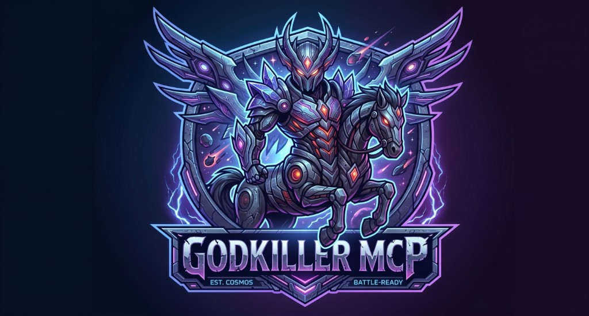

<p align="center">
  
</p>

<h1 align="center">GODKILLER MCP</h1>

<p align="center">
  <strong>Gates on disk beat chat.</strong><br/>
  The agent may <em>say</em> done. The harness decides.
</p>

<p align="center">
  Built for <strong>Google Antigravity</strong> · works on other MCP hosts too<br/>
  Plan → gate → verify on disk → <code>claim_done</code>
</p>

<p align="center">
  <a href="https://pypi.org/project/godkiller-mcp/"></a>
  <a href="https://python.org"></a>
  <a href="LICENSE"></a>
  <a href="https://github.com/taurus42119-stack/godkiller-mcp/actions/workflows/ci.yml"></a>
  <a href="https://github.com/taurus42119-stack/godkiller-mcp/stargazers"></a>
</p>

<p align="center">
  <a href="https://instagram.com/Kayvin.th">Instagram @Kayvin.th</a>
  ·
  <a href="https://github.com/taurus42119-stack/godkiller-mcp">Star the repo</a>
  ·
  <code>pip install godkiller-mcp</code>
</p>

---

## The problem everyone feels

AI coding agents are loud and optimistic.

- They type **“Fixed! All done.”** while tests still fail.
- They dump fat JSON into context until the model forgets the goal — and your token bill climbs.
- They skip `/plan`, edit twenty files, and call it a day.
- Chat becomes the source of truth. Disk never gets a vote.

**GODKILLER flips that.**  
If it isn’t proven on disk, it isn’t done.

---

## Who it’s for

Developers, AI engineers, and power users who run agents hard — and refuse to trust the chat bubble.

| Pain | Without GODKILLER | With GODKILLER |
| --- | --- | --- |
| **Fake completion** | “เรียบร้อยครับ” / “All green” in chat | `claim_done` blocked until verify + evidence land |
| **Token bloat** | Schema / dump floods every turn | Compact payloads by default |
| **Skipped ritual** | Plan → edit → vibes | Phase gates · illegal jumps die |
| **Blind edits** | Multi-file rush, no blast | `edit_safe` · blast · hollow · fault probe |

---

## Why people install it

### Proof over promises
Chat vibes don’t open the gate. Sealed evidence on disk does.

### Phase kernel that actually bites
`gk_route` puts the agent on a real pipeline:

| Mode | Job |
| --- | --- |
| `/ask` | Read-only. Answers with citations. |
| `/plan` | Spec first. No silent “just ship it.” |
| `/debug` | Repro + hypotheses before the fix. |
| `/ultradeep` | One file · think → plan → edit. |
| `/view` | Study patterns. Don’t paste a whole repo as done. |
| `/verify` | Disk proof → then `claim_done`. |

### One MCP. Full surface.
Code · scan · browser · guard · memory · handoff — facades in one place.  
Pair specialty MCPs as brains. GODKILLER is the **judge**.

### The flex
> The model proposes. GODKILLER disposes.

```text
goal → mode → plan → search/blast → gated edit
    → disk verify → hollow → probe → exit → claim_done | blocked
```

---

## How to use (summary)

| | Do this |
| --- | --- |
| **Once (machine)** | `pip install godkiller-mcp` · add the MCP server · set `GODKILLER_SEAL_KEY` |
| **Once per project** | `godkiller-bootstrap --workspace .` · reload the IDE |
| **Prove (optional full lock)** | deny/allow live test · then `GODKILLER_WRITE_GUARD_PROVEN=1` |
| **Every task** | `/plan` → `gk_guard.set_paths` → `/ultradeep Phase N` → `/verify` → `claim_done` |

**Antigravity playbook (full):** [`docs/ANTIGRAVITY.md`](docs/ANTIGRAVITY.md)  
**Write-guard details:** [`docs/WRITE_GUARD_HOOKS.md`](docs/WRITE_GUARD_HOOKS.md) · **Host vs MCP:** [`docs/HOST_VS_MCP.md`](docs/HOST_VS_MCP.md)

---

## 60-second install

```bash
pip install godkiller-mcp
python -c "import secrets; print(secrets.token_hex(32))"
```

Drop into your MCP host config:

```json
{
  "mcpServers": {
    "godkiller": {
      "command": "godkiller-mcp",
      "env": {
        "GODKILLER_PROFILE": "ship",
        "GODKILLER_WORKSPACE": "/absolute/path/to/your/project",
        "GODKILLER_HOME": "/absolute/path/to/your/project/.godkiller-session",
        "GODKILLER_SEAL_KEY": "REPLACE_WITH_64_HEX",
        "GODKILLER_SEAL_REQUIRE_ENV": "1"
      }
    }
  }
}
```

Alternate entry: `python -m godkiller_mcp.server`  
From source: `pip install "git+https://github.com/taurus42119-stack/godkiller-mcp.git"`

Modes ship **inside the package** — a full `.agents/workflows` tree is **not** required.  
One `GODKILLER_HOME` per concurrent host.

**Ship tip:** wire host PreToolUse → `godkiller-write-guard`, then set `GODKILLER_WRITE_GUARD_PROVEN=1` **only after a live deny/allow test**.  
Until that hook is real, native Write can still bypass MCP tools.  
Details: [`docs/WRITE_GUARD_HOOKS.md`](docs/WRITE_GUARD_HOOKS.md) · [`docs/HOST_VS_MCP.md`](docs/HOST_VS_MCP.md) · [`docs/SEAL_KEY.md`](docs/SEAL_KEY.md)

### Intensity (honest)

| You installed | What you actually get |
| --- | --- |
| MCP only | Judge on the `gk_*` path. Native IDE Write is free. |
| + `.agents/AGENTS.md` | Soft standing orders. Agents can still skip. |
| + host write-guard (opt-in) | Native Write/Edit blocked unless allowlisted. |

We do **not** ship a hostile filesystem lock inside MCP. Full lock is **your** PreToolUse hook — templates: [`docs/templates/antigravity-write-guard.hooks.json`](docs/templates/antigravity-write-guard.hooks.json).

---

## Recommended

Full Antigravity steps: [`docs/ANTIGRAVITY.md`](docs/ANTIGRAVITY.md).

Install **GODKILLER MCP once** on your MCP host. For each new repo:

1. Copy the constitution into the project:
   ```bash
   mkdir -p .agents
   # from this repo / installed package:
   cp path/to/godkiller_mcp/bundled_agents/AGENTS.md .agents/AGENTS.md
   ```
   Or grab the tracked file:  
   [`src/godkiller_mcp/bundled_agents/AGENTS.md`](src/godkiller_mcp/bundled_agents/AGENTS.md)
2. Open the project in the host. MCP stays enabled at host level — **do not reinstall per folder**.
3. Start with `/plan` (Mermaid + `### Phase N` only). Execute with `/ultradeep Phase N`. Finish with `/verify` → `claim_done`.

That is enough for **gated MCP workflow**: **`.agents/AGENTS.md` + host MCP**.

### Full lock (optional)

Wire the **write-guard on the IDE host** (not inside MCP). Prefer one command after `pip install godkiller-mcp`:

```bash
godkiller-bootstrap --workspace .
```

This writes portable files only (no machine-specific paths in what you commit):

- `.agents/AGENTS.md` (if missing)
- `.agents/hooks.json` (merges Write|Edit PreToolUse; keeps other hooks)
- `.agents/hooks/godkiller-write-guard.cmd` (Windows) or `.sh` (POSIX)
- `.agents/hooks/godkiller-write-guard.local.cmd` / `.local.sh` — **machine pin** (gitignored; uses the Python that ran bootstrap)

| Want | Do |
| --- | --- |
| **On (full lock)** | `godkiller-bootstrap` · reload IDE · prove deny/allow · then `WRITE_GUARD_PROVEN=1` |
| **Off (normal IDE writes)** | Remove the Write|Edit PreToolUse entry from `.agents/hooks.json` · unset `WRITE_GUARD_PROVEN` |

**Attach (on):**

1. `godkiller-bootstrap --workspace .` (or copy templates from [`docs/templates/antigravity-write-guard.hooks.json`](docs/templates/antigravity-write-guard.hooks.json)).
2. Ensure `python -m godkiller_mcp.write_guard --help` works on the host.
3. Reload the IDE. Prove deny/allow (see [`docs/WRITE_GUARD_HOOKS.md`](docs/WRITE_GUARD_HOOKS.md)).
4. Only then set `GODKILLER_WRITE_GUARD_PROVEN=1` and prefer `GODKILLER_PROFILE=ship`.

Use the host’s **`.agents/`** layout.

**Detach (off):**

1. Delete the write-guard PreToolUse entry from `.agents/hooks.json`, or set `"enabled": false`.
2. Unset `GODKILLER_WRITE_GUARD_PROVEN` (and relax `PROFILE=ship` if you no longer want ship posture).
3. Reload the IDE. Turning off the GODKILLER MCP server alone does **not** remove the write-guard — remove the hook too.

Optional craft packs (`workflows/`, `skills/`) can come later.

---

## Try this

After MCP is live:

1. Call `gk_meta.status` — if it fails, stop. Don’t invent that the kernel is up.
2. `/plan` a real feature. Watch phase gates bite.
3. Fix with `blast_radius` → `edit_safe` — not chat “I searched.”
4. Finish with `gk_verify.exit` → `gk_phase.claim_done`.

No `.godkiller/` state on disk? You didn’t use the kernel. You used vibes.

---

## Tool map

| Facade | What it owns |
| --- | --- |
| `gk_meta` | Honesty status · 9-step plan |
| `gk_route` | Mode switchboard |
| `gk_task` | open · blast · edit_safe |
| `gk_phase` | assert · claim_done |
| `gk_evidence` | shots · visual_step · critic |
| `gk_verify` | bundle · hollow · probe · exit |
| `gk_memory` | lessons · marathon |
| `gk_code` | map · search · council · swarm |
| `gk_guard` | write allowlist for host hooks |
| `gk_scan` | heuristic scan |
| `gk_browser` | Playwright fallback (prefer chrome-devtools when present) |
| `gk_mode` | protocols · skills |
| `gk_handoff` | spec / feedback |

Agent protocol notes: [`docs/AGENT_PROTOCOL.md`](docs/AGENT_PROTOCOL.md)

---

## Star · fork · flex

If this killed a fake “done” for you — **star the repo**.  
Fork it. Wire it. Make your agent earn the win.

<p align="center">
  <a href="https://github.com/taurus42119-stack/godkiller-mcp">github.com/taurus42119-stack/godkiller-mcp</a>
</p>

---

## Security

[`SECURITY.md`](SECURITY.md)

---

## License

MIT © 2026 GODKILLER Team — [LICENSE](LICENSE)
