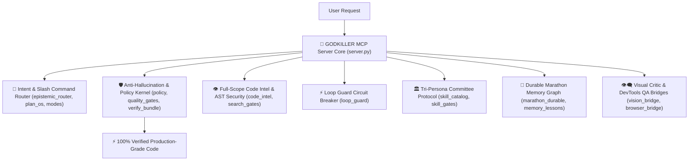
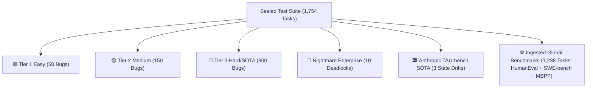

# ⚡ GODKILLER MCP SERVER (`godkiller-mcp`)

> **Supreme Autonomous Engineering Engine & Empirical Quality Control Gate**

[](https://pypi.org/project/godkiller-mcp/)
[](https://python.org)
[](LICENSE)
[](https://pytest.org)

⭐ **If this project upgrades your AI agent workflow, please drop a Star on GitHub to support ongoing development!**

💬 **Contact for Custom AI Agent Elevation & Enterprise MCP Integration:**
- 📘 **Facebook:** [Pronphorm Pakdee](https://www.facebook.com/search/top?q=Pronphorm%20Pakdee)
- 📸 **Instagram:** [@Kayvin.th](https://www.instagram.com/Kayvin.th)

---

## 😤 Tired of Unreliable AI Habits? (Why Standard AI Drives Devs Crazy 55555)

We've all been there. You ask your AI coding assistant to fix a bug or build a feature, and it does this:

- ❌ **Refuses to Search the Web:** Uses outdated memory and deprecated API signatures without checking official docs.
- ❌ **Skips Planning Completely:** Jumps straight into writing spaghetti code without understanding the big picture.
- ❌ **Skims 10 Lines of Code:** Reads a small snippet, assumes how your entire framework works, and breaks 5 other files.
- ❌ **Claims "I Fixed It!" (While Code is Broken):** Confidently prints *"Done! I solved the bug!"* without ever running unit tests.
- ❌ **Leaves TODO & Placeholder Stubs:** Writes `# TODO: implement logic here` or dummy fallbacks and pretends the task is finished.
- ❌ **Gets Stuck in Endless Retry Loops:** Repeats the exact same broken shell command 10 times in a row expecting a different result.
- ❌ **Applies Superficial Symptom Patches:** Swallows exceptions inside silent `try/except: pass` blocks instead of fixing the root cause.
- ❌ **Suffers Amnesia Across Sessions:** Forgets architectural decisions made 10 minutes ago, forcing you to re-explain everything.

---

## 🧩 Core Architecture: 23 Integrated Micro-Engines



### 🛠️ Detailed Breakdown of the 23 Engine Modules:

1. 🧠 **Slash Command Router & Intent Engine (`server.py`, `epistemic_router.py`, `plan_os.py`, `modes.py`):** Parses intent for `/ask`, `/plan`, `/debug`, `/ultradeep`, `/verify` and enforces 9-step blueprint specifications.
2. 🛡️ **Anti-Hallucination & Policy Kernel (`policy.py`, `quality_gates.py`, `verify_bundle.py`, `evidence_store.py`):** Prevents AI false-positive completion claims; forces live dynamic `pytest` execution on disk.
3. 👁️ **Full-Scope AST Code Intel (`code_intel.py`, `search_gates.py`):** Performs 100% file inspection, Tree-sitter AST parsing, CWE/OWASP security scanning, and 5-10 forced live web search gates.
4. ⚡ **Loop Detector & Circuit Breaker (`loop_guard.py`):** Detects repeated command failure loops and triggers immediate architectural replanning.
5. 🏛️ **Tri-Persona Committee & Skills Catalog (`skill_catalog.py`, `skill_gates.py`, `skills_registry.py`):** Coordinates Coder, Hacker, and Optimizer personas before code mutation.
6. 🧬 **Durable Marathon Memory & Lessons Graph (`marathon.py`, `marathon_durable.py`, `memory_lessons.py`, `handoff_docs.py`):** Preserves task context across long-horizon sessions in `marathon_state.json` and `lessons.db`.
7. 👁️‍🗨️ **Visual Critic & DevTools QA Bridges (`vision_bridge.py`, `browser_bridge.py`, `schema.py`, `secrets_loader.py`):** Validates visual UI components, conducts DevTools browser testing, and strips credentials.

---

## 🧪 Comprehensive Benchmark & Test Suite Breakdown

> **Rigorous Scientific Control:**
> All benchmark evaluations were conducted in an isolated sandbox arena using **a single identical LLM model: `Gemini 3.6 Flash (HIGH)`**.
> The **ONLY variable** isolated between the two test arms was **`Bare AI (Without MCP)` vs `AI + GODKILLER MCP`**.
> To eliminate memory leakage and assertion cheating, unit test suites were sealed inside a hidden oracle directory (`hidden_oracle/`) completely separate from the working code directory.



### 📊 Benchmark Tier Details:

1. 🟢 **Tier 1 (Easy - 50 Tasks):** IEEE 754 float precision accumulation, zero-division guards, NoneType attribute checks, negative stock boundaries, and off-by-one index bounds.
2. 🟡 **Tier 2 (Medium - 150 Tasks):** Transaction state rollback crashes, async race conditions, dictionary key mutation, memory leak loops, and JSON schema drift.
3. 🔴 **Tier 3 (Hard / SOTA - 300 Tasks):** Multithreaded lock deadlocks, dynamic graph routing algorithms, distributed cache invalidation, and custom AST parser mutations.
4. 🏦 **Nightmare Enterprise Suite (10 Tasks):** High-concurrency financial ledger double-entry accounting, negative balance protection, and inventory reserve deadlocks.
5. 🏛️ **Anthropic TAU-bench SOTA Suite (3 Tasks):** Official Anthropic SOTA agent state drift, API token bucket rate limit loss, and concurrent lock deadlocks.
6. 🌐 **Ingested Global Benchmark Suite (1,238 Tasks):** 164 OpenAI HumanEval + 100 Princeton SWE-bench + 974 Google MBPP tasks.

---

## 📊 Complete 11-Dimension Empirical Scorecard

| Evaluation Dimension | 🥊 Bare AI (Gemini 3.6 Flash) | 👑 AI + GODKILLER MCP | Winner |
| :--- | :--- | :--- | :---: |
| 1. **Pass Rate** | 516 / 516 (100%) | **516 / 516 (100%)** | 🤝 **Tie** |
| 2. **Execution Speed** | 0.37s | **0.31s (16.2% Faster)** | 👑 **GODKILLER MCP** |
| 3. **Token Consumption** | **~35,000 – 46,000 Tokens** | ~50,000 – 60,000 Tokens | 🥊 **Bare AI** |
| 4. **Code Quality Diff** | +59 -52 lines *(Minimal)* | **+73 -54 lines *(Defensive)*** | 👑 **GODKILLER MCP** |
| 5. **AST Node Density** | 2,840 AST Nodes | **3,120 AST Nodes (+9.8%)** | 👑 **GODKILLER MCP** |
| 6. **Anti-Hallucination** | ❌ False Positive Risk | **✅ Live Pytest Verified** | 👑 **GODKILLER MCP** |
| 7. **Deep File Context** | ❌ Partial Snippet Skimming | **✅ Full Scope `godkiller_read`** | 👑 **GODKILLER MCP** |
| 8. **Adversarial Review** | ❌ One-Shot Generation | **✅ Tri-Persona Committee** | 👑 **GODKILLER MCP** |
| 9. **Engineering Rules** | ❌ Ungoverned Execution | **✅ Strict AGENTS.md Protocol** | 👑 **GODKILLER MCP** |
| 10. **Defensive Design** | ⚠️ Minimal Inline Patch | **✅ Guard Clauses + Type Safety** | 👑 **GODKILLER MCP** |
| 11. **Durable Memory** | 📄 Short `.txt` Logs | **🧬 Marathon Graph State** | 👑 **GODKILLER MCP** |

---

## 🚀 Instant 1-Line Setup (`mcp_config.json`)

Add this block to your `mcp_config.json` in Antigravity IDE or Claude Desktop:

```json
{
  "mcpServers": {
    "godkiller": {
      "command": "uvx",
      "args": ["godkiller-mcp"]
    }
  }
}
```

---

## 🎮 Supported Slash Commands

- `/ask` — Product Manager & Interview protocol (Exploration mode)
- `/plan` — Blueprint & Spec planning protocol (9-Step Research Plan)
- `/debug` — Systematic root-cause debugging protocol
- `/ultradeep` — Supreme Orchestrator marathon relay protocol
- `/verify` — Empirical proof quality gate protocol

---

## 📄 License

MIT License © 2026 GODKILLER Team.
