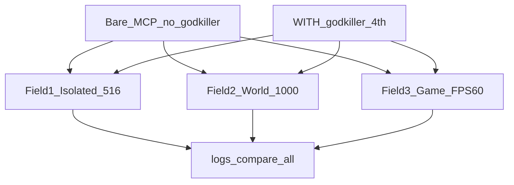

# MEGA A/B — รอบเดียวเข้ม (Field 1 + 2 + 3)

ปากซื่อ: นี่คือ **แคมเปญ A/B ภายใน** Bare vs GODKILLER — ไม่ใช่คะแนน leaderboard สาธารณะจนกว่าใช้ harness ทางการของชุดนั้น + มีใบเสร็จใน `logs/`

## สนามในรอบนี้ (บังคับครบ)

| Field | Root | คะแนนเครื่อง | Hard bar |
| --- | --- | --- | --- |
| **1 Isolated** | `GODKILLER_ISOLATED_ARENA` | `score_11` | oracle collect ≥516 · ห้ามชนะด้วย delta=0 · dims 5–11 ต้องมี sealed evidence ถ้าอ้าง MCP |
| **2 World** | `GODKILLER_WORLD_ARENA` | `score_world` | Track A volume ≥1000 tests · Track B SWE-Live = harness ทางการเท่านั้น (อย่าปลอมเป็น LCB) |
| **3 Game** | `GODKILLER_GAME_ARENA` | `score_game` | build+boot+playable · median FPS ≥**60** · `mode≠stub` · ตาคนเปิด preview |

คนละ workspace — **ห้ามปนโฟลเดอร์**



## กติกาเข้ม (ทั้งแคมเปญ)

1. **Bare ก่อนทั้งสามสนาม** แล้วค่อย WITH — หรือ Bare ทั้งก้อนจบก่อนเปิด godkiller (ห้ามสลับ MCP กลางสนาม)
2. Bare MCP = 3 ตัว (`chrome-devtools`, `jcodemunch-mcp`, `codebase-memory-mcp`) · **ไม่มี godkiller**
3. WITH = 3 + `godkiller` ชี้ `python -m godkiller_mcp.server` ในแพ็กเกจจริง · เรียก `gk_meta.status` ก่อนอ้าง tool
3b. **Process dims (5–11):** ตั้ง `GODKILLER_ARENA_ARM=<...>/2_WITH_MCP` ก่อน `sync_mcp_with.ps1` เพื่อให้ `GODKILLER_HOME` ชี้ไปที่ `2_WITH_MCP/.godkiller` — scorer อ่านแค่ sealed `task_*.json` ใต้แขน ไม่ใช่ `~/.godkiller` ของเครื่อง · export **`GODKILLER_SEAL_KEY` ชุดเดียว** ตอนรัน agent และตอน `python -m benchmarks.score_11`
3c. เชนบังคับบน disk: `open_task` → exhaustive (`server_authored`) → `blast_radius` + `check_edit_safe` → `verify_bundle` → `council_finalize` → `fault_probe`/`hollow`/`write_guard` → `visual_critic` → claim/exit — ห้ามอ้างชนะ process จาก `proof.json` / chat
4. Prompt / งบโมเดล / เวลา wall ต่อสนาม **เท่ากัน** สองแขน
5. ห้ามเปิด `hidden_oracle/` ตอนแข่ง
6. ห้าม claim “ชนะโลก / SWE score / ชนะ Opus” จากแชทอย่างเดียว
7. Soft story ในแชทไม่นับ — มีแต่ JSON ใน `logs/`

## ลำดับรัน (รอบเดียว)

### 0) Sync + reset ทั้งสาม

```powershell
cd "<godkiller_mcp_pypi_package>"
.\scripts\sync_mcp_bare.ps1
# restart Antigravity

$env:GODKILLER_ARENA_ROOT = "$env:USERPROFILE\Desktop\GODKILLER_ISOLATED_ARENA"
$env:GODKILLER_WORLD_ARENA_ROOT = "$env:USERPROFILE\Desktop\GODKILLER_WORLD_ARENA"
$env:GODKILLER_GAME_ARENA_ROOT = "$env:USERPROFILE\Desktop\GODKILLER_GAME_ARENA"

python -m benchmarks.reset_arena
python -m benchmarks.reset_world_arena
python -m benchmarks.reset_game_arena
```

### 1) BARE marathon

| ขั้น | Workspace | ทำอะไร | วัด |
| --- | --- | --- | --- |
| 1a | `...\ISOLATED\3_WITHOUT_MCP` | แก้โจทย์ให้ oracle ผ่าน | `score_11 --arm 3_WITHOUT_MCP` |
| 1b | `...\WORLD\lcb\3_WITHOUT_MCP` | แก้ volume Track A | `score_world --arm 3_WITHOUT_MCP` |
| 1c | `...\GAME\3_WITHOUT_MCP` | สร้าง FPS Three.js | `score_game --arm 3_WITHOUT_MCP` + preview |

### 2) เปิด GODKILLER (ตัวที่ 4) แล้ว reset แขน WITH อย่างเดียว

```powershell
# ใส่ godkiller ใน mcp_config แล้ว restart
python -m benchmarks.reset_arena --arm 2_WITH_MCP
python -m benchmarks.reset_world_arena --arm 2_WITH_MCP
python -m benchmarks.reset_game_arena --arm 2_WITH_MCP
```

### 3) WITH marathon (prompt ชุดเดียวกับ Bare ต่อสนาม)

| ขั้น | Workspace | วัด |
| --- | --- | --- |
| 3a | `...\ISOLATED\2_WITH_MCP` | `score_11 --arm 2_WITH_MCP` |
| 3b | `...\WORLD\lcb\2_WITH_MCP` | `score_world --arm 2_WITH_MCP` |
| 3c | `...\GAME\2_WITH_MCP` | `score_game --arm 2_WITH_MCP` + preview |

### 4) เปรียบเทียบ

```powershell
python -m benchmarks.score_11 --compare
python -m benchmarks.score_world --compare
python -m benchmarks.score_game --compare
python -m benchmarks.mega_scorecard
```

ใบสรุป: `GODKILLER_ISOLATED_ARENA\logs\mega_scorecard.json` (หรือ Desktop รวม)

## เกณฑ์ “ปิดปากรอบนี้”

- มีใบเสร็จ Bare+WITH ครบสามสนาม
- ไม่มีแขนที่ผ่านด้วยการก๊อป oracle / delta=0 น่าสงสัยโดยไม่ธง
- Game: `hard_pass` หรือ fail ซื่อๆ · FPS≥60
- World: collected ≥1000 บน oracle path · ปากไม่ claim LCB official leaderboard ถ้ายังใช้ pack ภายใน
- Isolated: ปิด OPEN เดิมด้วย compare ที่อ่านได้

**SWE-Live Track B:** รันคู่ขนานได้ถ้า docker พร้อม — ไม่บล็อกปิดรอบ Field1/3/TrackA แต่ห้ามเอายอด TrackA ไปพูดแทน SWE

## Proof-Kernel Next — Slice D receipt (2026-08-01)

Goal: prove **arm-local** `GODKILLER_HOME` + shared `GODKILLER_SEAL_KEY` lights **dims 5–11** (fail-closed sealed path). Not a claim that an agent marathon just beat Bare.

```powershell
$env:GODKILLER_SEAL_KEY = "<64 hex shared with scorer>"
$env:GODKILLER_ISOLATED_ARENA = "$env:USERPROFILE\Desktop\GODKILLER_ISOLATED_ARENA"
# optional: $env:GODKILLER_ARENA_ARM = "...\2_WITH_MCP" before sync_mcp_with.ps1
python scripts/mint_arm_process_dims.py   # sealed task under 2_WITH_MCP/.godkiller/tasks
python -m benchmarks.score_11 --arm 2_WITH_MCP
```

**Observed (this machine, after mint):** `logs/score_2_WITH_MCP.json` — dims **5–11 all 100** with `sealed_sources` including `verify_bundle`, `council_finalize`, `fault_probe`, `exit_checklist`, `visual_critic`. Oracle dims 1–4 were already green on that arm from prior work; mint only proves process-signal plumbing.

**Honest gap:** full campaign still needs a live WITH agent session that *earns* those seals via tools (not only `mint_arm_process_dims.py`). Unit proof: `tests/test_process_dims_arm.py`.
